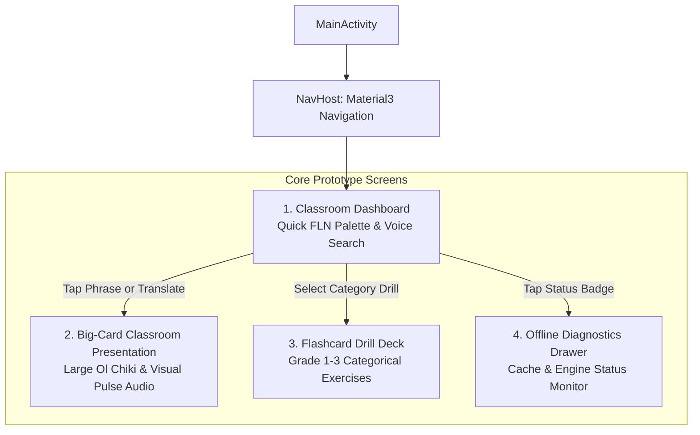

# Android Frontend Architecture & UI/UX Specification: Vernacular Pedagogy

**Target Platform:** Android (API 26+ / Android 8.0 Oreo through Android 15)  
**Language & Framework:** Kotlin 2.0+ | Jetpack Compose (Material 3) | Kotlin Coroutines & StateFlow  
**Hardware Target:** Ultra-budget Classroom Tablets / Phones (2 GB – 4 GB RAM, Quad-core ARM64)  
**Operating Mode:** 100% Offline Edge Execution (Zero network dependency)  
**Scripts Supported:** Hindi Devanagari (`hin_Deva`) $\rightarrow$ Santhali Ol Chiki (`sat_Olck`, `U+1C50`–`U+1C7F`)

---

## 1. Pedagogical UX Philosophy & Real-World Classroom Context

In rural and tribal primary classrooms (e.g., in Jharkhand, Odisha, and West Bengal), teachers face three major challenges:
1. **Multi-Grade Noisy Environments:** Acoustic clarity and visual legibility must be instantaneous. A teacher addressing 30+ students cannot wait for a loading spinner.
2. **Font & Glyph Rendering ("Tofu" Prevention):** Android devices do not natively ship with Ol Chiki glyphs pre-installed. The app must package and render native OpenType/TrueType Ol Chiki fonts (`Noto Sans Ol Chiki`) across all UI elements.
3. **Severe Hardware Constraints:** Background inference of CTranslate2 INT8 MT and Piper ONNX TTS must share limited RAM (<300 MB total heap). The Compose layer must avoid recomposition cascades and allocate zero redundant objects during audio playback.

### Core UX Rules:
- **Instant Touch-to-Speech (<10 ms response):** Tapping any FLN phrase begins audio playback immediately from the SQLite fast-path cache.
- **Large Ol Chiki Typography (Classroom Visibility):** Essential Santhali text is rendered in **32sp – 40sp bold**, allowing children seated at the back of the classroom to read characters.
- **High-Contrast Warm Earth Palette:** High ambient sunlight readability using a warm earthy pedagogical palette (Terracotta, Ochre, Forest Green, Sand Surface) that feels welcoming to young learners.
- **Dual-Speed Audio Controls:** 1-Tap toggle for **1.0x Normal** and **0.75x Drill Speed** (ideal for choral classroom repetition).

---

## 2. Information Architecture & Navigation Flow



---

## 3. Screen-by-Screen UI/UX Specifications

### Screen 1: Classroom Dashboard (`DashboardScreen.kt`)
*The home command center for primary educators during active classroom instruction.*

#### Key Components:
1. **Top Pedagogical App Bar:**
   - App title: **"ᱥᱮᱪᱮᱫ ᱜᱟᱛᱮ" (Learning Companion)**.
   - Offline Status Pill: Green pulsing dot with `"Offline Ready (368 FLN)"`. Tapping opens the Diagnostics Drawer.
   - Script Switcher Badge: `"हिन्दी ➔ ᱥᱟᱱᱛᱟᱲᱤ"` (Visual confirmation of direction).
2. **Search & Voice Input Bar:**
   - Text input with immediate autocomplete matching the 368 SQLite FLN entries.
   - Microphone icon for offline voice input (Android SpeechRecognizer / Vosk).
   - Clear button (`IconButton`) for instant reset.
3. **Horizontal Domain Carousel (Pedagogical Categories):**
   - 15 pill chips: `All`, `Greetings (ᱡᱚᱦᱟᱨ)`, `Classroom Commands (ᱦᱩᱠᱩᱢ)`, `Numbers (ᱞᱮᱠᱷᱟ)`, `Hygiene (ᱦᱚᱲᱢᱚ ᱥᱟᱯᱷᱟ)`, `Colors (ᱨᱚᱝ)`, `Animals (ᱡᱤᱭᱟᱹᱞᱤ)`, etc.
   - Selecting a chip instantly filters the quick-action palette below.
4. **Quick-Action Palette (Two-Column Staggered Grid):**
   - Compact pedagogical cards containing:
     - Hindi instruction (e.g., *"किताब खोलो"*).
     - Santhali Ol Chiki rendering (e.g., *"ᱯᱚᱛᱚᱵ ᱨᱟᱲᱟᱭ ᱢᱮ"*).
     - Playback button (`IconButton`) that triggers instant audio synthesis without leaving the screen.
     - Card tap expands into Screen 2 (Big-Card Classroom Presentation).

---

### Screen 2: Big-Card Classroom Presentation (`PresentationCard.kt`)
*Designed for whole-classroom instruction where children view the screen from a distance or repeated choral drills take place.*

#### Key Components:
1. **Hero Display Card (High Contrast Surface):**
   - **Hindi Source:** Small, muted Devanagari font (16sp, Slate Gray).
   - **Ol Chiki Target:** Ultra-large, high-contrast Santhali font (**36sp Bold**, Charcoal Black `#1F2421`).
   - **Phonetic Guide:** Subtitle showing Latin pronunciation breakdown (e.g., *"Potob raṛay me"* in 14sp italic).
   - **Domain Chip:** e.g., `[Classroom Command • Grade 1]`.
2. **Interactive Audio Command Bar:**
   - **Primary Play Button (72dp Circular FAB):** Pulsing animated ripple while audio is speaking.
   - **Speed Selector (Segmented Button):** `0.75x Slow (Drill)` vs `1.0x Standard`.
   - **Loop / Repeat Toggle:** Repeats phrase 3 times with a 1.5s silence gap for choral repetition.
   - **Bookmark / Star:** Saves to "Today's Lesson" deck.

---

### Screen 3: Flashcard Vocabulary Drill (`DrillScreen.kt`)
*Interactive learning mode for small group exercises or student-led practice.*

#### Key Components:
1. **Swipeable Card Deck:**
   - Front: Visual icon + Hindi term.
   - Back: Ol Chiki text + instant audio pronunciation.
2. **Student Practice Controls:**
   - *"Listen Again"* (Speaker icon).
   - *"Next Word"* (Arrow Forward).
   - Progress bar: e.g., `Card 7 / 20`.

---

## 4. Jetpack Compose Design System Tokens (`ui/theme/`)

### 4.1 Color Palette (Earthy Pedagogical Material 3)

```kotlin
// ui/theme/Color.kt
package com.vernacular.pedagogy.ui.theme

import androidx.compose.ui.graphics.Color

// Primary Earthy Tones
val TerracottaPrimary = Color(0xFFB85D3B)
val TerracottaOnPrimary = Color(0xFFFFFFFF)
val TerracottaContainer = Color(0xFFFFDBD0)
val OnTerracottaContainer = Color(0xFF3B1003)

// Secondary Warm Ochre / Accents
val OchreSecondary = Color(0xFF8D6E18)
val OchreOnSecondary = Color(0xFFFFFFFF)
val OchreContainer = Color(0xFFFBE08A)

// Surfaces & Backgrounds (Soft Sand to reduce eye strain in daylight)
val SandSurface = Color(0xFFFAF7F2)
val SandSurfaceVariant = Color(0xFFEFE9DF)
val TextCharcoal = Color(0xFF1F2421)
val TextMuted = Color(0xFF6B7280)

// Operational Status Colors
val OfflineGreen = Color(0xFF2E7D32)
val OfflineGreenContainer = Color(0xFFE8F5E9)
val ModelActiveBlue = Color(0xFF1565C0)
```

---

### 4.2 Typography & Ol Chiki Font Definition

```kotlin
// ui/theme/Type.kt
package com.vernacular.pedagogy.ui.theme

import androidx.compose.material3.Typography
import androidx.compose.ui.text.TextStyle
import androidx.compose.ui.text.font.Font
import androidx.compose.ui.text.font.FontFamily
import androidx.compose.ui.text.font.FontWeight
import androidx.compose.ui.unit.sp
import com.vernacular.pedagogy.R

// Bundled Noto Sans Ol Chiki font family
val OlChikiFontFamily = FontFamily(
    Font(R.font.noto_sans_ol_chiki_regular, FontWeight.Normal),
    Font(R.font.noto_sans_ol_chiki_bold, FontWeight.Bold)
)

val PedagogicalTypography = Typography(
    // Hero Ol Chiki text for back-of-class visibility
    displayLarge = TextStyle(
        fontFamily = OlChikiFontFamily,
        fontWeight = FontWeight.Bold,
        fontSize = 36.sp,
        lineHeight = 44.sp,
        letterSpacing = 0.5.sp
    ),
    // Standard Card Ol Chiki text
    headlineMedium = TextStyle(
        fontFamily = OlChikiFontFamily,
        fontWeight = FontWeight.Bold,
        fontSize = 24.sp,
        lineHeight = 32.sp
    ),
    // Hindi translation source text
    titleMedium = TextStyle(
        fontWeight = FontWeight.SemiBold,
        fontSize = 18.sp,
        lineHeight = 24.sp
    ),
    // Subtitles & Latin pronunciation guides
    bodyMedium = TextStyle(
        fontSize = 14.sp,
        lineHeight = 20.sp
    )
)
```

---

## 5. Implementation Architecture & Code Scaffolding

### 5.1 Project Directory Structure

```
app/src/main/java/com/vernacular/pedagogy/
├── data/
│   ├── local/
│   │   ├── FlnDatabase.kt              // SQLite asset loader (fln_lexicon.sqlite)
│   │   └── FlnLexiconDao.kt            // Fast-path indexed queries (<0.1ms)
│   ├── engine/
│   │   ├── CTranslate2Translator.kt    // C++ JNI bridge to indictrans2_sat_int8
│   │   └── PiperTtsPlayer.kt           // ONNX Runtime Android audio synthesizer
│   └── repository/
│       └── TranslationRepositoryImpl.kt// Tiered lookup (SQLite -> CTranslate2)
├── domain/
│   ├── model/
│   │   ├── FlnPhrase.kt                // Core phrase domain model
│   │   └── TranslationResult.kt        // Output with latency & engine source
│   └── usecase/
│       ├── TranslatePhraseUseCase.kt
│       └── SynthesizeSpeechUseCase.kt
└── presentation/
    ├── dashboard/
    │   ├── DashboardScreen.kt          // Primary screen
    │   ├── DashboardViewModel.kt       // StateFlow holder
    │   └── components/
    │       ├── FlnPaletteCard.kt       // Grid card item
    │       ├── DomainCarousel.kt       // Category pill chips
    │       └── SearchInputBar.kt       // Input with STT trigger
    ├── presentation_mode/
    │   └── BigCardDialog.kt            // 36sp classroom modal
    └── ui/
        └── theme/                      // Color, Type, Theme tokens
```

---

### 5.2 Reactive UI State & Contract Pattern

```kotlin
// presentation/dashboard/DashboardContract.kt
package com.vernacular.pedagogy.presentation.dashboard

import com.vernacular.pedagogy.domain.model.FlnPhrase

data class DashboardUiState(
    val searchQuery: String = "",
    val selectedDomain: String = "All",
    val domains: List<String> = emptyList(),
    val quickPhrases: List<FlnPhrase> = emptyList(),
    val activePlayingPhraseId: String? = null,
    val presentationPhrase: FlnPhrase? = null,
    val speechRate: Float = 1.0f,
    val isTtsLoading: Boolean = false,
    val offlineStatus: OfflineEngineStatus = OfflineEngineStatus()
)

data class OfflineEngineStatus(
    val isReady: Boolean = true,
    val cachedPhrasesCount: Int = 368,
    val mtEngineReady: Boolean = true,
    val ttsEngineReady: Boolean = true,
    val activeLatencyMs: Double = 0.0
)

sealed interface DashboardUiEvent {
    data class OnSearchQueryChanged(val query: String) : DashboardUiEvent
    data class OnDomainSelected(val domain: String) : DashboardUiEvent
    data class OnPlaySpeech(val phrase: FlnPhrase, val speed: Float = 1.0f) : DashboardUiEvent
    data class OnOpenPresentationCard(val phrase: FlnPhrase) : DashboardUiEvent
    object OnDismissPresentationCard : DashboardUiEvent
    data class OnChangeSpeed(val speed: Float) : DashboardUiEvent
}
```

---

### 5.3 Production Compose Components

#### 1. The Quick-Action FLN Card (`FlnPaletteCard.kt`)

```kotlin
// presentation/dashboard/components/FlnPaletteCard.kt
package com.vernacular.pedagogy.presentation.dashboard.components

import androidx.compose.foundation.clickable
import androidx.compose.foundation.layout.*
import androidx.compose.foundation.shape.RoundedCornerShape
import androidx.compose.material.icons.Icons
import androidx.compose.material.icons.rounded.PlayArrow
import androidx.compose.material.icons.rounded.VolumeUp
import androidx.compose.material3.*
import androidx.compose.runtime.Composable
import androidx.compose.ui.Alignment
import androidx.compose.ui.Modifier
import androidx.compose.ui.text.font.FontWeight
import androidx.compose.ui.text.style.TextOverflow
import androidx.compose.ui.unit.dp
import androidx.compose.ui.unit.sp
import com.vernacular.pedagogy.domain.model.FlnPhrase
import com.vernacular.pedagogy.ui.theme.OlChikiFontFamily

@Composable
fun FlnPaletteCard(
    phrase: FlnPhrase,
    isPlaying: Boolean,
    onCardClick: () -> Unit,
    onPlayClick: () -> Unit,
    modifier: Modifier = Modifier
) {
    Card(
        modifier = modifier
            .fillMaxWidth()
            .clickable(onClick = onCardClick),
        shape = RoundedCornerShape(16.dp),
        colors = CardDefaults.cardColors(
            containerColor = MaterialTheme.colorScheme.surfaceVariant
        ),
        elevation = CardDefaults.cardElevation(defaultElevation = 2.dp)
    ) {
        Column(
            modifier = Modifier.padding(14.dp)
        ) {
            // Category Badge
            Surface(
                shape = RoundedCornerShape(6.dp),
                color = MaterialTheme.colorScheme.primaryContainer.copy(alpha = 0.6f),
                modifier = Modifier.padding(bottom = 6.dp)
            ) {
                Text(
                    text = phrase.domain,
                    style = MaterialTheme.typography.labelSmall,
                    color = MaterialTheme.colorScheme.onPrimaryContainer,
                    modifier = Modifier.padding(horizontal = 6.dp, vertical = 2.dp)
                )
            }

            // Santhali Ol Chiki Display (Primary Prominence)
            Text(
                text = phrase.santhaliOlchiki,
                fontFamily = OlChikiFontFamily,
                fontWeight = FontWeight.Bold,
                fontSize = 20.sp,
                color = MaterialTheme.colorScheme.onSurface,
                maxLines = 2,
                overflow = TextOverflow.Ellipsis,
                lineHeight = 26.sp
            )

            Spacer(modifier = Modifier.height(4.dp))

            // Hindi Source Instruction
            Text(
                text = phrase.hindiDevanagari,
                style = MaterialTheme.typography.bodyMedium,
                color = MaterialTheme.colorScheme.onSurfaceVariant,
                maxLines = 1,
                overflow = TextOverflow.Ellipsis
            )

            Spacer(modifier = Modifier.height(8.dp))

            // Action Row: Audio Playback & Latency Indicator
            Row(
                modifier = Modifier.fillMaxWidth(),
                horizontalArrangement = Arrangement.SpaceBetween,
                verticalAlignment = Alignment.CenterVertically
            ) {
                Text(
                    text = "<0.1ms Cache",
                    style = MaterialTheme.typography.labelSmall,
                    color = MaterialTheme.colorScheme.outline
                )

                FilledTonalIconButton(
                    onClick = onPlayClick,
                    colors = IconButtonDefaults.filledTonalIconButtonColors(
                        containerColor = if (isPlaying) MaterialTheme.colorScheme.primary else MaterialTheme.colorScheme.surface
                    ),
                    modifier = Modifier.size(36.dp)
                ) {
                    Icon(
                        imageVector = if (isPlaying) Icons.Rounded.VolumeUp else Icons.Rounded.PlayArrow,
                        contentDescription = "Pronounce Santhali",
                        tint = if (isPlaying) MaterialTheme.colorScheme.onPrimary else MaterialTheme.colorScheme.primary,
                        modifier = Modifier.size(20.dp)
                    )
                }
            }
        }
    }
}
```

---

#### 2. The Big-Card Classroom Presentation Dialog (`BigCardDialog.kt`)

```kotlin
// presentation/presentation_mode/BigCardDialog.kt
package com.vernacular.pedagogy.presentation.presentation_mode

import androidx.compose.animation.core.*
import androidx.compose.foundation.background
import androidx.compose.foundation.layout.*
import androidx.compose.foundation.shape.CircleShape
import androidx.compose.foundation.shape.RoundedCornerShape
import androidx.compose.material.icons.Icons
import androidx.compose.material.icons.rounded.Close
import androidx.compose.material.icons.rounded.VolumeUp
import androidx.compose.material3.*
import androidx.compose.runtime.*
import androidx.compose.ui.Alignment
import androidx.compose.ui.Modifier
import androidx.compose.ui.draw.scale
import androidx.compose.ui.graphics.Color
import androidx.compose.ui.text.font.FontStyle
import androidx.compose.ui.text.font.FontWeight
import androidx.compose.ui.text.style.TextAlign
import androidx.compose.ui.unit.dp
import androidx.compose.ui.unit.sp
import androidx.compose.ui.window.Dialog
import com.vernacular.pedagogy.domain.model.FlnPhrase
import com.vernacular.pedagogy.ui.theme.OlChikiFontFamily

@Composable
fun BigCardDialog(
    phrase: FlnPhrase,
    isPlaying: Boolean,
    currentSpeed: Float,
    onSpeedChange: (Float) -> Unit,
    onPlay: (Float) -> Unit,
    onDismiss: () -> Unit
) {
    Dialog(onDismissRequest = onDismiss) {
        Card(
            modifier = Modifier
                .fillMaxWidth()
                .padding(8.dp),
            shape = RoundedCornerShape(24.dp),
            colors = CardDefaults.cardColors(containerColor = MaterialTheme.colorScheme.surface)
        ) {
            Column(
                modifier = Modifier.padding(24.dp),
                horizontalAlignment = Alignment.CenterHorizontally
            ) {
                // Header Row
                Row(
                    modifier = Modifier.fillMaxWidth(),
                    horizontalArrangement = Arrangement.SpaceBetween,
                    verticalAlignment = Alignment.CenterVertically
                ) {
                    AssistChip(
                        onClick = {},
                        label = { Text(phrase.domain) }
                    )
                    IconButton(onClick = onDismiss) {
                        Icon(Icons.Rounded.Close, contentDescription = "Close")
                    }
                }

                Spacer(modifier = Modifier.height(16.dp))

                // Source Hindi
                Text(
                    text = phrase.hindiDevanagari,
                    style = MaterialTheme.typography.titleMedium,
                    color = MaterialTheme.colorScheme.onSurfaceVariant,
                    textAlign = TextAlign.Center
                )

                Spacer(modifier = Modifier.height(12.dp))

                // Large Ol Chiki Presentation (36sp)
                Text(
                    text = phrase.santhaliOlchiki,
                    fontFamily = OlChikiFontFamily,
                    fontWeight = FontWeight.Bold,
                    fontSize = 36.sp,
                    lineHeight = 46.sp,
                    color = MaterialTheme.colorScheme.onSurface,
                    textAlign = TextAlign.Center
                )

                // Phonetic Guide / Transliteration
                if (phrase.phoneticGuide.isNotEmpty()) {
                    Spacer(modifier = Modifier.height(8.dp))
                    Text(
                        text = phrase.phoneticGuide,
                        style = MaterialTheme.typography.bodyMedium,
                        fontStyle = FontStyle.Italic,
                        color = MaterialTheme.colorScheme.primary,
                        textAlign = TextAlign.Center
                    )
                }

                Spacer(modifier = Modifier.height(28.dp))

                // Pulsing Audio Button
                val infiniteTransition = rememberInfiniteTransition(label = "pulse")
                val pulseScale by infiniteTransition.animateFloat(
                    initialValue = 1.0f,
                    targetValue = if (isPlaying) 1.15f else 1.0f,
                    animationSpec = infiniteRepeatable(
                        animation = tween(600, easing = FastOutSlowInEasing),
                        repeatMode = RepeatMode.Reverse
                    ),
                    label = "scale"
                )

                Box(
                    contentAlignment = Alignment.Center,
                    modifier = Modifier.size(90.dp)
                ) {
                    if (isPlaying) {
                        Box(
                            modifier = Modifier
                                .fillMaxSize()
                                .scale(pulseScale)
                                .background(
                                    MaterialTheme.colorScheme.primary.copy(alpha = 0.2f),
                                    CircleShape
                                )
                        )
                    }
                    FilledIconButton(
                        onClick = { onPlay(currentSpeed) },
                        modifier = Modifier.size(72.dp),
                        colors = IconButtonDefaults.filledIconButtonColors(
                            containerColor = MaterialTheme.colorScheme.primary
                        )
                    ) {
                        Icon(
                            Icons.Rounded.VolumeUp,
                            contentDescription = "Speak Phrase",
                            modifier = Modifier.size(36.dp),
                            tint = MaterialTheme.colorScheme.onPrimary
                        )
                    }
                }

                Spacer(modifier = Modifier.height(20.dp))

                // Speed Selector Bar
                Row(
                    horizontalArrangement = Arrangement.Center,
                    verticalAlignment = Alignment.CenterVertically
                ) {
                    FilterChip(
                        selected = currentSpeed == 0.75f,
                        onClick = { onSpeedChange(0.75f) },
                        label = { Text("0.75x Slow (Drill)") },
                        modifier = Modifier.padding(end = 8.dp)
                    )
                    FilterChip(
                        selected = currentSpeed == 1.0f,
                        onClick = { onSpeedChange(1.0f) },
                        label = { Text("1.0x Normal") }
                    )
                }
            }
        }
    }
}
```

---

## 6. Performance & Low-Memory Optimization Checklist

1. **Font Assets:** Bundle `noto_sans_ol_chiki_regular.ttf` in `app/src/main/res/font/`. Never download fonts dynamically at runtime in an offline classroom app.
2. **Audio Track Re-use:** When synthesizing speech via Piper ONNX, stream PCM buffer directly into a persistent `android.media.AudioTrack` instance. Do not spawn a new `MediaPlayer` per clip to avoid garbage collection hitches.
3. **Database Pre-seeding:** Place `fln_lexicon.sqlite` in `app/src/main/assets/databases/` so Room/SQLite opens the pre-indexed B-Tree without initial migration delay.
4. **Compose Stability:** Use `@Immutable` data classes for all UI models (`FlnPhrase`, `OfflineEngineStatus`) to ensure Jetpack Compose skips recomposition of unmodified cards during audio pulse animations.
